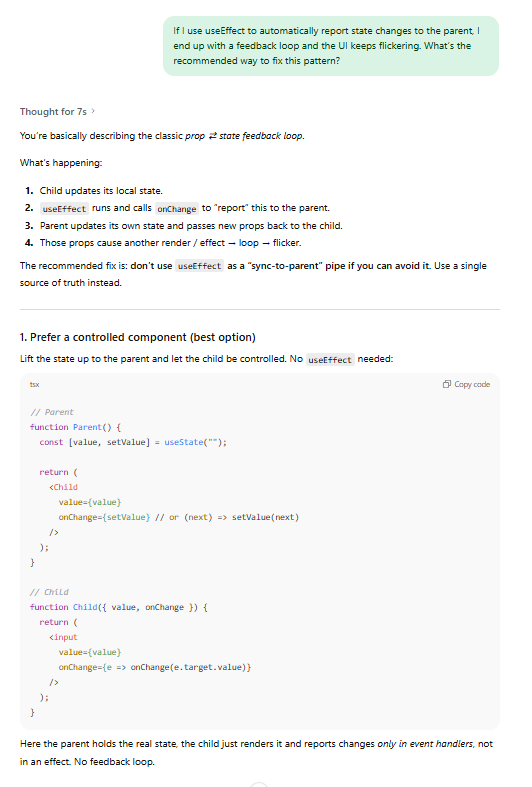
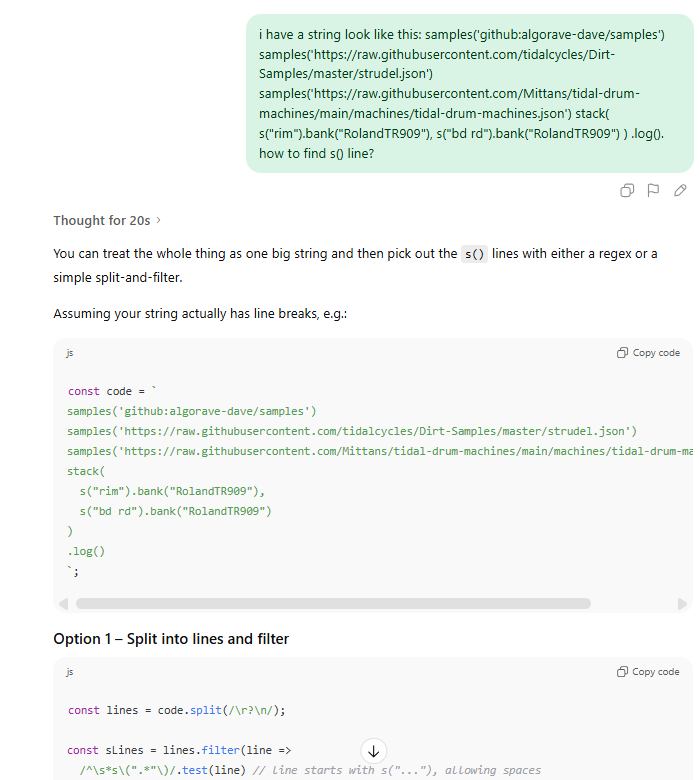
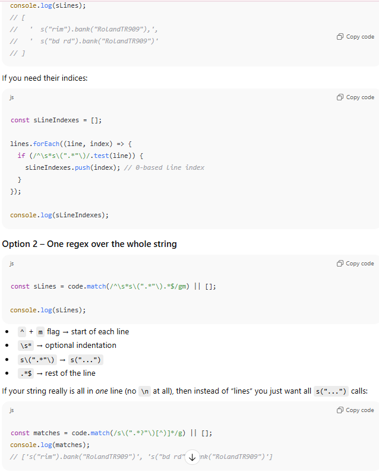
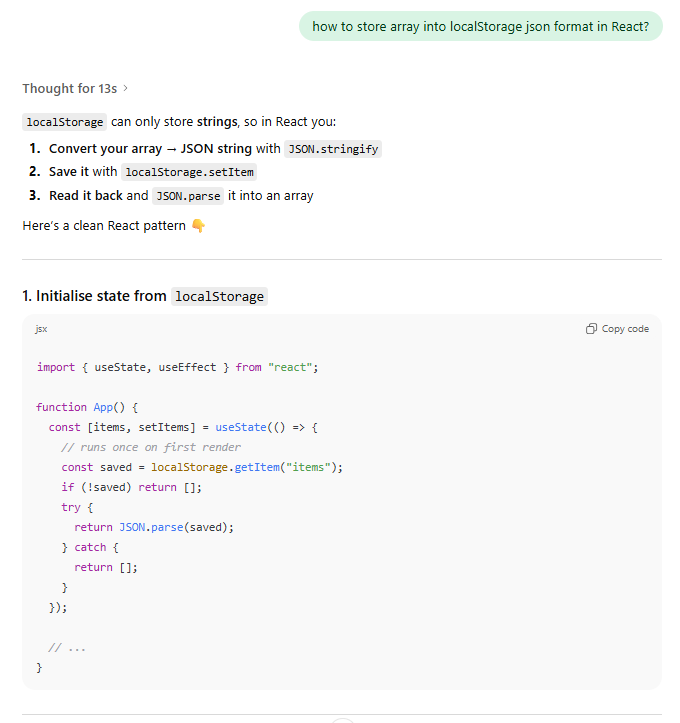
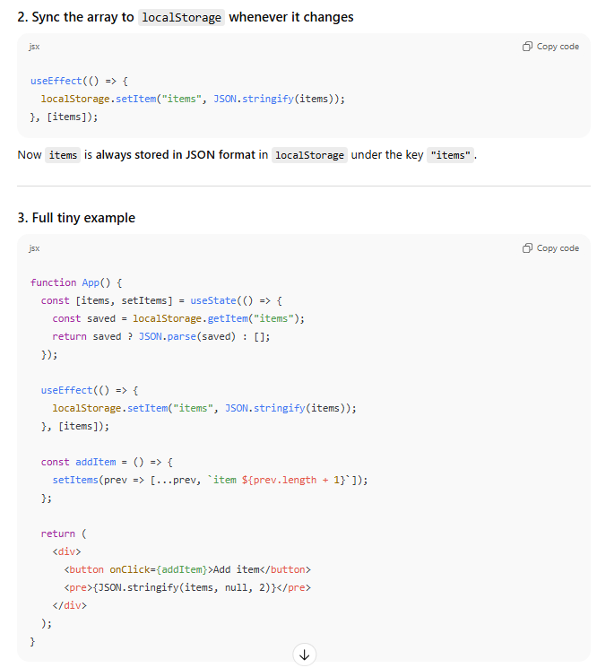

# Interactive Drum Editor for Strudel
This project is React-based and designed for performing strudel drum patterns in the browser.
It generates and manipulates Strudel code through a set of interactive controls.
It also allows saving and searching song using JSON handling and uses D3 visualisation to show drums in action.

---
## Controls Overview
The interface is divided into four main areas:

### 1. Pattern Builder (Add/Edit/Delete Patterns)

-**Save/Search**
- Song name input: type a name for the current song
- Save button:
	- Save current `songText` (full Strudel code)
	- Extracted `lines` (`s("...")` line)
	- Effects: room, delay, phaser, duckorbit
	- Mix: volume and speed
	- Tempo: bpm and bpc
- Search: seaches for a stored song by name
- Data is stored in a `localStorage` under the key `StrudelDemo`
- When saving
	- if name is new -> a new song object is appended
	- if name is already exist -> an alert asks whether to overwriter it

-**Add Pattern**
	- Add a new `s("...")` line (drum pattern line).
	- Each line corresponds to an instrument pattern in Strudel..

-**Add single/fastcat/slowcat**
	- *single*: one drum sound
	- *fastcat*: concatenates patterns faster
	- *slowcat*: concatenate patterns slowly

-**Drum sound dropdowns**
	- Choices such as bass drum, snare durm, rimshot, hi-hat and so on

-**Remove/Delete**
	- Remove the drum song

### 2. D3 Visualisation
- D3 graph that visualises the current drum pattern
- Horizontal (x) axis: all drum sounds used in the pattern
- Vertical (y) axis: drum occurs duration, showed in `console.log()`
- Color: interpolaTurbo

### 3. Control Panel

##### Instrument
- **Play**: Default mode, played normally
- **Mute**: Rewrites the line with `.take(0)`, means silent
- **Reverse**: Rewrites the line with `.rev()`, means playbackwards
- Each row corresponds to one pattern line
- Chaning the radio buttons rewrites only that line in the Strudel code

#### Global Effects
- `room`: reverb
- `delay`
- `phaser`
- `duckorbit`
- Each effect has a **checkbox** and **dropdown** to select a value
- when click the checkbox, the effect adds after the `log()`
- when unclick the checkbox, the effect is removed

#### Volume & Speed
- **volume**: maps to Strudel's `.gain()` function, range `0-10` (0 means off)
- **speed**: maps to Strudel's `.fast()` function, range `0-10` (0 means off)
- when change, the function just inject before the `.log()` in the Strudel code

#### Tempo
- `bpm`: Beats per minutes, range 40-180
- `bpc`: Beats per cycle, allowed value: 1, 2, 4, 8
- Adjust with **+/-** button or manually type and click **Apply**
- On Apply, the code's tempo line is updated: `setcpm(bpm/bpc)`
- If the input is out of range or invalid, an alert will displayed and not change anything

### 4. Code Block
- show executable Strudel code

---
## Video
Demo Video: https://youtu.be/MbZOLLKPrac

---
## AI

---
## Code Inspired

- Bootstrap: https://getbootstrap.com/docs/5.3/getting-started/introduction/
- Drum Effects: https://strudel.cc/learn/effects/
- Drum machine: https://github.com/geikha/tidal-drum-machines/tree/main/machines
- D3 color: https://d3js.org/d3-scale-chromatic/sequential
- Generate a unique ID: https://www.raisiqueira.io/blog/react-random-id
- Lifting state: https://react.dev/learn/sharing-state-between-components
- Regular expressions: https://developer.mozilla.org/en-US/docs/Web/JavaScript/Guide/Regular_expressions
- Strudel: https://strudel.cc/workshop/getting-started/
- Updating Objects in State:
	https://react.dev/learn/updating-objects-in-state
	https://stackoverflow.com/questions/55495198/reacts-setstate-method-with-prevstate-argument
	https://react.dev/reference/react/useState
